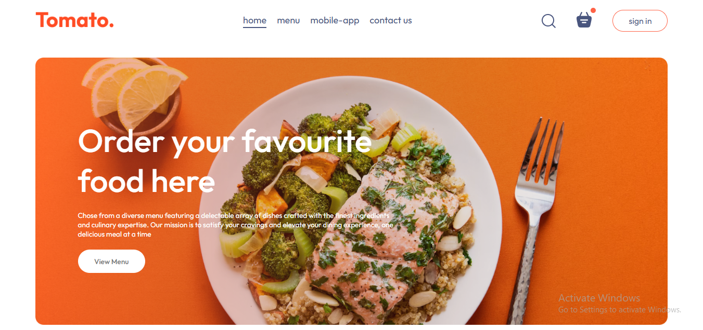
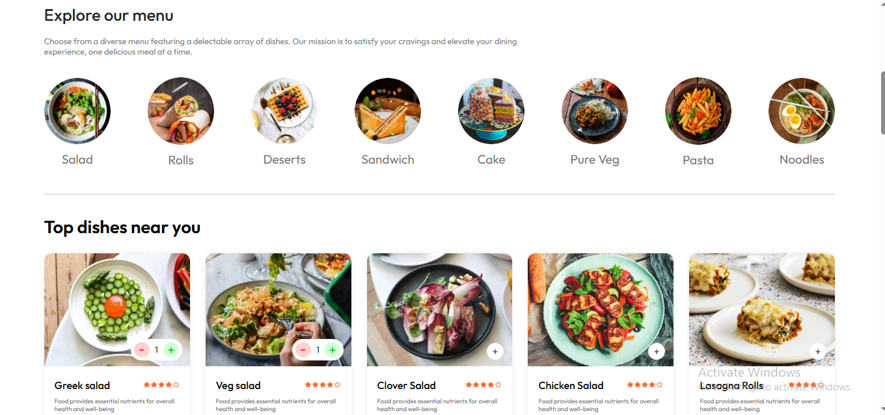

# 🍔 Umbra Food Delivery

A full-stack **MERN** food delivery web application that connects users with restaurants in real time.  
Built for speed, simplicity, and scalability — with secure Stripe payments, user authentication, and a sleek custom UI.

---

## 🖼️ Screenshots

---

## Tech Stack

This project was built using the following technologies and tools:

### Core Framework
- **[React](https://react.dev/)** – Frontend library for building dynamic UIs  
- **[Node.js](https://nodejs.org/)** – Backend JavaScript runtime  
- **[Express](https://expressjs.com/)** – RESTful API framework  
- **[MongoDB](https://www.mongodb.com/)** – NoSQL database for structured data  

### Routing
- **[React Router](https://reactrouter.com/)** – Declarative client-side routing for React  
  - Used `useNavigate` for seamless navigation between pages  

### Authentication & Security
- **[JWT](https://jwt.io/)** – JSON Web Tokens for secure user sessions  
- **[bcrypt](https://www.npmjs.com/package/bcrypt)** – Password hashing for authentication  

### Payments
- **[Stripe](https://stripe.com/)** – Payment gateway for handling secure transactions  

### Frontend Styling
- **Vanilla CSS** – Custom handcrafted styling for every component  
- **[Bootstrap Icons](https://icons.getbootstrap.com/)** – Lightweight, modern icon set  

### File Uploads
- **[Multer](https://www.npmjs.com/package/multer)** – Middleware for handling image uploads  

### Development Tools
- **[Axios](https://axios-http.com/)** – For client–server API communication  
- **[Nodemon](https://www.npmjs.com/package/nodemon)** – Auto-reload utility for backend development  

---
